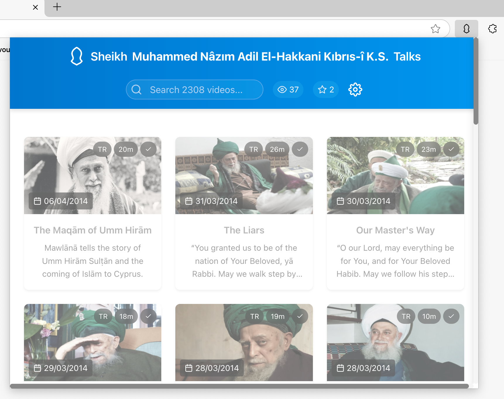

# Chromium Extension of Sheikh Muhammed Nâzım Adil El-Hakkani Kıbrıs-î K.S. Sohbats

A Chrome extension to watch and listen to Sheikh Muhammed Nâzım Adil El-Hakkani Kıbrıs-î K.S. Sohbats.



## Features

- Browse and watch sohbats
- Filter by language (English, Turkish, Arabic)
- Mark favorites and track watched sohbats
- Full-text search in title and description
- Responsive and modern UI

## Development

This extension is built with:
- Vite
- Solid.js
- TypeScript
- CRXJS

### Setup

1. Clone the repository
2. Install dependencies:
   ```bash
   pnpm install
   ```

3. Run development server:
   ```bash
   pnpm dev
   ```

4. Build for production:
   ```bash
   pnpm build
   ```

### Installing the Extension

1. Build the extension or download from releases section
2. Open Chrome and navigate to `chrome://extensions`
3. Enable "Developer mode"
4. Click "Load unpacked" and select the unpacked archive directory

### Donate

If you want to donate, please use your local charities.

قُلْ مَا سَأَلْتُكُم مِّنْ أَجْرٍۢ فَهُوَ لَكُمْ ۖ إِنْ أَجْرِىَ إِلَّا عَلَى ٱللَّهِ ۖ وَهُوَ عَلَىٰ كُلِّ شَىْءٍۢ شَهِيدٌۭ

Say, “If I had ever asked you for a reward, you could keep it. My reward is only from Allah. And He is a Witness over all things.” (34/47)

### Contribute

Feel free to fork clone and distribute this project.

Abu Mas’ud reported: The Prophet, peace and blessings be upon him, said, “Whoever guides someone to goodness will have a reward like one who did it.”

Source: Ṣaḥīḥ Muslim 1893

Grade: Sahih (authentic) according to Muslim

عَنْ أَبِي مَسْعُودٍ الْأَنْصَارِيِّ عَنِ النَّبِيِّ صَلَّى اللَّهُ عَلَيْهِ وَسَلَّمَ قَالَ مَنْ دَلَّ عَلَى خَيْرٍ فَلَهُ مِثْلُ أَجْرِ فَاعِلِهِ

1893 صحيح مسلم كتاب الإمارة باب فضل إعانة الغازي في سبيل الله بمركوب وغيره وخلافته في أهله بخير


### License

MIT & Some assets may vary.
